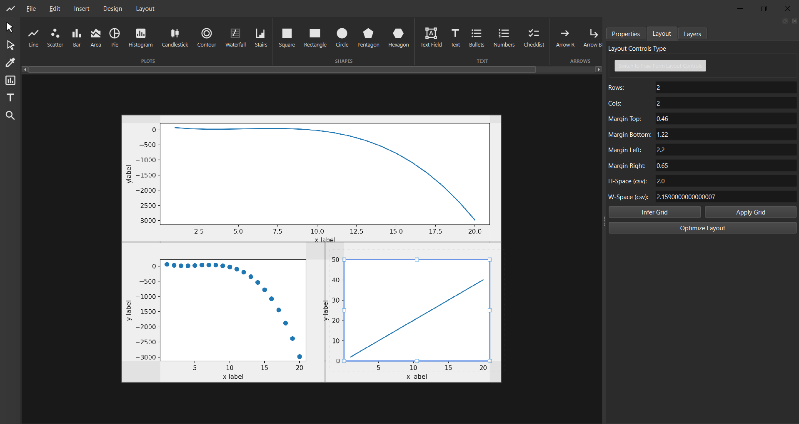

# SciFig

 

SciFig is a scientific graphics application for Python that combines data plotting with vector-style layout management. It provides a non-modal environment where scientific plots (Matplotlib) can be manipulated with the same spatial flexibility as objects in a vector graphics editor, while maintaining full data-linkage and reproducibility.

## Key Features

### Layout & Scene Management
*   **Hybrid Layouts:** Supports both structured $M \times N$ grids (with cell merging/spanning) and free-form coordinate-based placement.
*   **Hierarchical Scene Graph:** Elements are managed in a tree structure allowing for grouping, layering (Z-order), and visibility toggling.
*   **Real-time Overlays:** An interaction layer provides visual guides for grid gutters, margins, and alignment without triggering expensive scientific re-renders.

### Data & Plotting
*   **Artist Support:** Native implementations for Line, Scatter, Bar, Image (Imshow), and Contour plots.
*   **Coordinate Systems:** Support for Cartesian and Polar coordinate spaces.
*   **Theming Engine:** Centralized service for applying journal-specific styles (e.g., Nature, Science) via `.mplstyle` and YAML configurations.
*   **Type Safety:** Core properties like colors and physical dimensions are managed as immutable value objects to prevent state corruption.

### State & Performance
*   **Command Pattern:** All user actions are encapsulated as undoable commands, maintaining a consistent history.
*   **Dual-Layer Rendering:** Uses a lightweight Qt Interaction Layer for immediate feedback during mouse operations, syncing with the high-fidelity Matplotlib layer only on completion.
*   **Asynchronous I/O:** File loading and data processing are handled in background threads to maintain UI responsiveness.

## Architecture

The project follows a **Passive View MVP (Model-View-Presenter)** architecture. For a detailed breakdown of the system design and design decisions, see the **[Architecture Design Document](./docs/architecture-design-document.md)**.

*   **Model:** A headless scene graph containing the application state and scientific data.
*   **View:** A passive PySide6 interface that forwards events and displays data.
*   **Controller:** Orchestrates logic between the model and view, using an `EventAggregator` for decoupled communication.

## Project Status
SciFig is currently in active development.
*   **Current Version:** Phase 3 (Structured Grids, Spanning, and Unified Spatial Transforms) is complete.
*   **Next Milestone:** Phase 4 (Advanced Annotations and Data Callouts) is currently in the planning stage.

## Installation

### Prerequisites
*   Python 3.11+
*   Conda or venv

### Setup
1. Clone the repository:
   ```bash
   git clone https://github.com/your-repo/sci-fig.git
   cd data-analysis-gui
   ```
2. Install dependencies:
   ```bash
   pip install .
   ```
   Or for development (including test dependencies):
   ```bash
   pip install -e ".[dev]"
   ```
3. Run the application:
   ```bash
   python main.py
   ```

## Project Structure

*   [`src/models/`](./src/models/): Scene graph nodes and plot property definitions.
*   [`src/services/`](./src/services/): Core domain logic (Layout, Style, Coordinate transforms, Commands).
*   [`src/controllers/`](./src/controllers/): Presenters managing the flow between UI and Model.
*   [`src/ui/`](./src/ui/): View components and the specialized Figure/Overlay renderers.
*   [`src/shared/`](./src/shared/): Value objects (Color, Dimension) and common types.
*   [`configs/`](./configs/): Application settings and Matplotlib styles.
*   [`templates/`](./templates/): JSON definitions for standard figure layouts.

## Documentation
Additional technical documentation is available in the `/docs` directory:
*   [Product Requirements](./docs/product-requirements-document.md)
*   [Software Requirements](./docs/software-requirements-specification.md)
*   [Features Overview](./docs/features.md)

